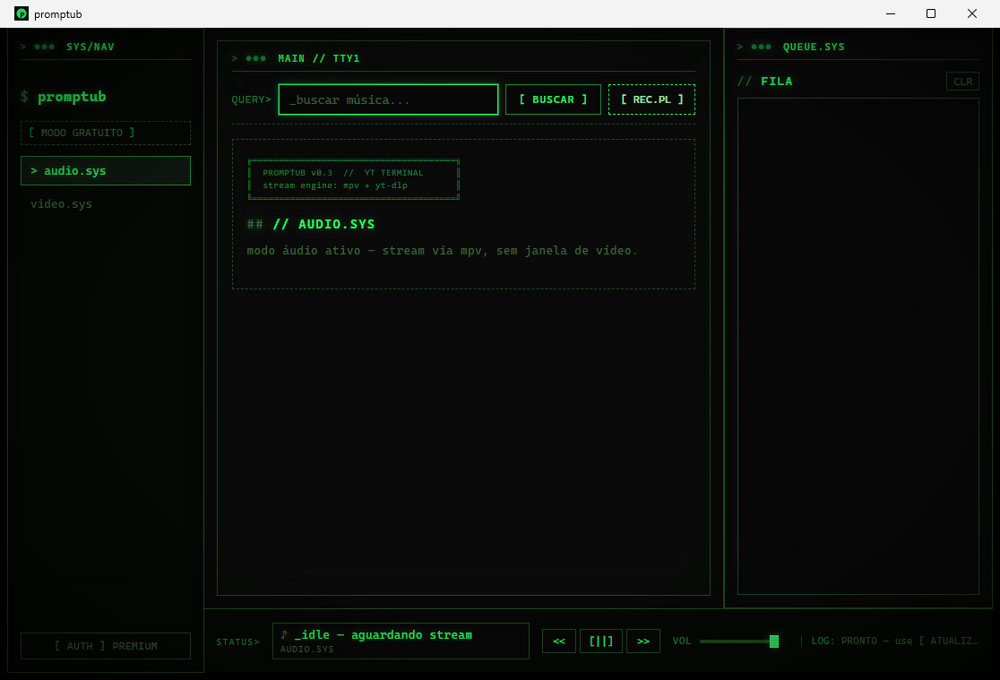
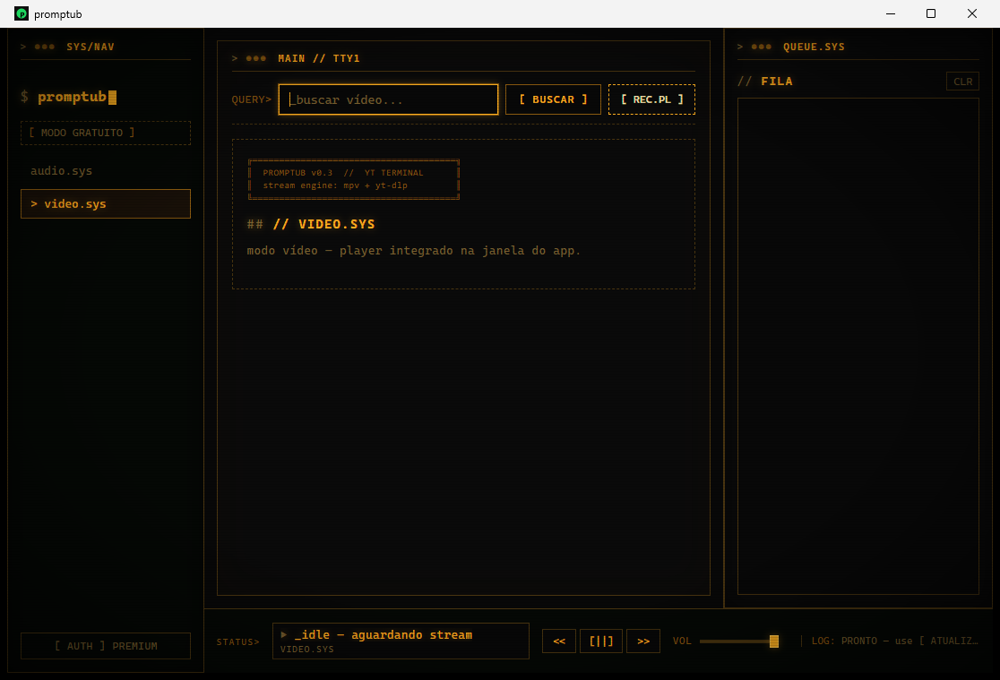
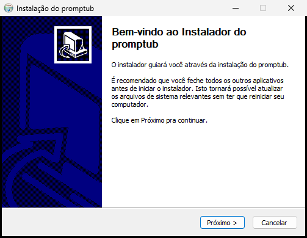

# promptub

YouTube e YouTube Music como **app desktop leve** — interface estilo terminal, sem depender do Chrome no dia a dia.

[](https://github.com/Joao-Savi/promptub)
[](https://tauri.app)
[](LICENSE)

---

## Screenshots

### Modo música (audio.sys)



### Modo vídeo (video.sys)



### Instalador



---

## O que é?

O **promptub** é um player de YouTube para Windows que usa:

| Componente | Função |
|-----------|--------|
| **Tauri 2** | Janela nativa leve (Rust + HTML) |
| **yt-dlp** | Busca, metadados e URL de stream |
| **mpv** | Reprodução de áudio/vídeo |

Em vez de abrir o YouTube no navegador (centenas de MB a GB de RAM), você usa uma janela pequena (~80–150 MB) focada só em ouvir/assistir.

---

## É mais leve que o navegador?

**Sim**, para o uso previsto:

| | promptub | Chrome + YouTube |
|--|---------|------------------|
| RAM típica | ~80–150 MB | 500 MB – 2 GB+ |
| Abas / anúncios / extensões | Não | Sim |
| Interface | Terminal vintage, focada | Site completo |

O mpv só decodifica o stream — não roda JavaScript do site nem carrega a página do YouTube.

---

## Instalação

### Usuário final

1. Baixe o instalador em **[Releases](https://github.com/Joao-Savi/promptub/releases)** ou use o gerado localmente: `bin\promptub_0.3.0_x64-setup.exe`
2. Execute e siga: **Avançar → Instalar**
3. O pacote inclui **yt-dlp** e **mpv** — nada extra para baixar

Ou na pasta do projeto:

```cmd
INSTALAR.cmd
```

### Desenvolvedor

Requisitos: **Node.js 18+**, **Rust**, **Visual C++ Build Tools 2022**

```cmd
git clone https://github.com/Joao-Savi/promptub.git
cd promptub
npm install
scripts\build-tauri.cmd
```

Saída: `bin\promptub.exe` e `bin\promptub_*_setup.exe`

---

## Uso rápido

| Ação | Como |
|------|------|
| Buscar | Digite na barra e **Enter** ou `[ BUSCAR ]` |
| Tocar | `[ PLAY ]` no card |
| Fila | `[ +Q ]` ou clique na fila à direita |
| Recomendados | `[ ATUALIZAR ]` (não atualiza sozinho) |
| Playlist | `[ REC.PL ]` → revisar → `[ +FILA ]` |
| Volume | Slider **VOL** na barra inferior |
| Premium | `[ AUTH ]` — cookies do Edge (opcional) |

### Modos

- **audio.sys** — só áudio, mpv em background
- **video.sys** — vídeo na área **STREAM // VIDEO** dentro do app

---

## Arquitetura

```
Interface (Vite/JS)  →  Rust/Tauri  →  yt-dlp + mpv
                                    →  keyring (Premium)
```

- **Recomendados:** mix/radio YouTube + histórico por modo (até 8 itens)
- **Lives:** busca transmissões `is_live` no modo vídeo (até 4)
- **Pré-aquecimento:** até 6 faixas da playlist resolvidas em background (só áudio) para iniciar mais rápido

---

## Estrutura do projeto

```
promptub/
├── src/                 # Frontend (HTML/CSS/JS)
├── src-tauri/src/       # Backend Rust
├── scripts/             # Build e instalador
├── docs/screenshots/    # Imagens do README
├── INSTALAR.cmd         # Atalho para o setup
└── README.md
```

> **Nota:** Não há código Go no projeto — o app é **Tauri + Rust**. Arquivos `go.mod` / `internal/` eram de um protótipo antigo e foram removidos.

---

## Solução de problemas

| Problema | Solução |
|----------|---------|
| Vídeo não toca | Atualize para a última build; feche outros mpv abertos |
| `localhost` / ERR_CONNECTION_REFUSED | O `.exe` foi gerado sem frontend. Rode `scripts\build-tauri.cmd` ou `INSTALAR.cmd` |
| yt-dlp / mpv não encontrado | Reinstale com o `*_setup.exe` |
| CMD piscando | Use build recente (processos ocultos) |
| Acentos errados | Reporte — app usa UTF-8 end-to-end |

---

## Licença

MIT — uso pessoal. YouTube é serviço de terceiros; respeite os Termos de Uso do Google.

**promptub** não é afiliado ao YouTube, Spotify ou Google.

---

Desenvolvido por [Joao-Savi](https://github.com/Joao-Savi)
